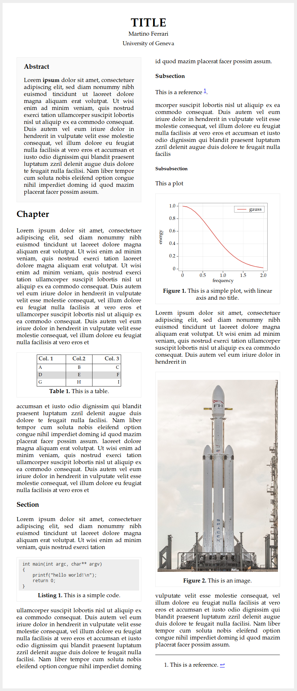

Scidown
=======

`Scidown` is a fork of [Hoedown](https://github.com/hoedown/hoedown),
a c Markdown parser. `Scidown` however it parse not only Markdown but also Scidown (yep same name) that support many features useful for scientific and scholar publishing.

Features
--------

*	**Integrated plot** using [charter](https://github.com/mandarancio/charter
*   **Figures, Tables and Listings with caption**
*   **YAML header** specify title, authors, css style, keywords and more
*   **Abstract** syntax for defining abstracts
*   **Include external files** include external files to build complex documents

Markdown Differences
--------------------
A part of the extension added to the language there is only one difference in the output generated from `scidown` and `hoedown` of a standard `markdown` document:

 * `# title` becomes `<h2>title</h2>` instead of `<h1>`
 * `## subtitle` becomes `<h3>subtitle</h3>` instead of `<h2>`
 * well I suppose you get it all the headers are shifted of one

This is due the addition of the title information in form of `YAML` head as explained in the following section.

Special Syntax
--------------

### YAML Head

Is possible to add information and configuration in form of a `YAML` header:

```markdown
---
title: your title
authors: list of authors
affiliation: affiliation
style: css file
keywords: list of keywords
---

Rest of your markdown file
```

the `title`, `authors` and `keywords` will be used both as metadata of the html and displayed in the output.

### External Files

Is possible to include external files to make easier work with big documents:

```markdown
@include(path)
```
As bibliography only:

```markdown
@bib(path)
```

### Abstract

The abstract section is particularly useful for possible automatic data retrieval (as in such way is clearly identifiable from the rest of the paper).
The output will figure the `<h2>Abstract</h2>` in the top of the `div` and at the bottom a `div` containing the `keywords` (if defined in the `YAML` head).

```markdown
@abstract
Lorem ipsum ....

@/
```

### Floating elements

Is possible to use floating elements such as figures, listings and tables:

Example:
```markdown
@figure(ref_id)

@caption(your caption)
@/
```
The code included in the figure is user defined and can be anything not only an image. The `ref_id` is not obligatory as the `caption`.
The syntax for listings and tables is similar:

```markdown
@table(id)

@/

@listing(id)

@/
```

### Numbered equation

The numbered equation works as the other floating elements but without any captioning possible:

```markdown
@equation(id)
x = \sum_{i=1}{N} i
@/
```

In line and block equation with the classical syntax `$inline equation$` and `$$block equation$$` are still available but not numbered.

### Plots

using the `charter` syntax in a code block:

~~~markdown
```charter
plot:
  x: 1 2 3 4
  y: math:x^2
```
~~~

Example
--------
An example of `scidwon` syntax is available in the ```examples/``` folder, this is a screenshot of the parsing of a simple example using the `scidown_article.css` style:



The following is the same document using instead the `scidown_report.css` style:

